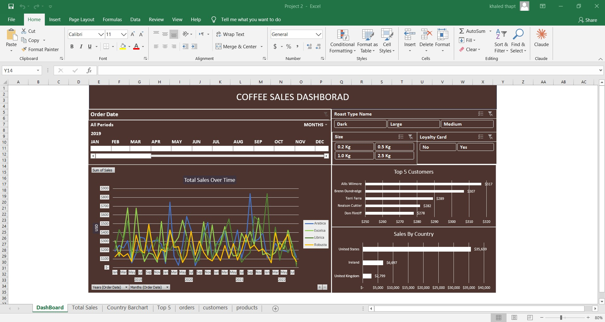

# ☕ Coffee Sales Analysis — Excel

## 📌 Project Overview
An interactive Excel-based data analysis project that monitors and evaluates coffee shop sales performance. The analysis tracks key operational patterns, customer loyalty behavior, and purchasing habits across different geographic locations, coffee sizes, and roast types.

## 🎯 Business Questions Answered
- How are total sales distributed over time and across different years?
- Which countries generate the highest coffee sales revenue?
- Who are the top 5 customers contributing to the business volume?
- What are the preferences regarding coffee roast types, sizes, and loyalty card usage?

## 🛠️ Tools Used

| Tool | Purpose |
|---|---|
| Microsoft Excel | Core Data Analysis & Dashboard Design |
| Pivot Tables | Data Aggregation & KPI Summarization |
| Slicers & Timeline | Dynamic Interactive Filtering |
| Excel Charts | Advanced Data Visualization |

## 💡 Key Insights
- **Top Sales Countries**: The United States dominates sales revenue significantly compared to Ireland and the United Kingdom.
- **Roast Type Preferences**: The shop monitors customer preferences across three main categories: Dark, Large, and Medium roasts.
- **Top Customer Performance**: Individual customer sales are tightly tracked, with the top customer exceeding **$315** in purchases.
- **Sizing Breakdown**: Coffee size demands are segmented from small individual packs to bulk scales (**0.2 Kg, 0.5 Kg, 1.0 Kg, and 2.5 Kg**).

## 📁 Files

| File | Description |
|---|---|
| `Project 2.xlsx` | Main Excel workbook containing clean data, pivot tables, and dashboard |
| `dashboard_preview.png` | Dashboard preview screenshot |

## 📷 Dashboard Preview

## 🔗 Connect with Me

